# Review of PVS-Studio

PVS-Studio is a program that looks for bugs in the source code of C++ and C# projects that can't be seen by the compiler yet are almost sure to be programming mistakes.

## Introduction

I was contacted by the guys from the PVS-Studio team with a collaboration proposal. I have read a lot about their product on [Habrahabr](https://habr.com/ru/company/pvs-studio/), pages but never tried it. So, I suggested the following: they would give me a product license, and I would scan my programs and write a review of the tool, where I'd discuss how I was using the analyzer, how the codes were checked, and so on. They said yes.

So, what you are going to see in this article is, as it's trendy to call nowadays, an honest review without any embroidery by an ordinary, average programmer who deals with academic programming rather than application programming. In other words, I'm no guru from some large company working on complex projects who knows his way around tons of utilities and is good at compiler optimizations, and all that.

Another thing you should know is that I was a devoted functional-programming fan just a few years ago. I didn't favor OOP, never used namespaces, reinvented the wheel lots of times, and so on. Now I'm recalling that period of my life as nightmarish and actively rewrite many of my programs of those times, though they are not ready for static analysis yet. For that reason, l will take the projects from my functional-programming past (they all can be found on GitHub) for analysis. Although functionalism reigns there, I was very careful about coding, testing, and documenting when writing them, so I don't think there should be many serious bugs in those projects.

Here we go.

## Installation

Installation didn't cause any problems. There is a large button `Download and try` on the [home page](https://www.viva64.com/ru/pvs-studio/) of the PVS-Studio site, which takes you to a page with a download link that you won't miss:

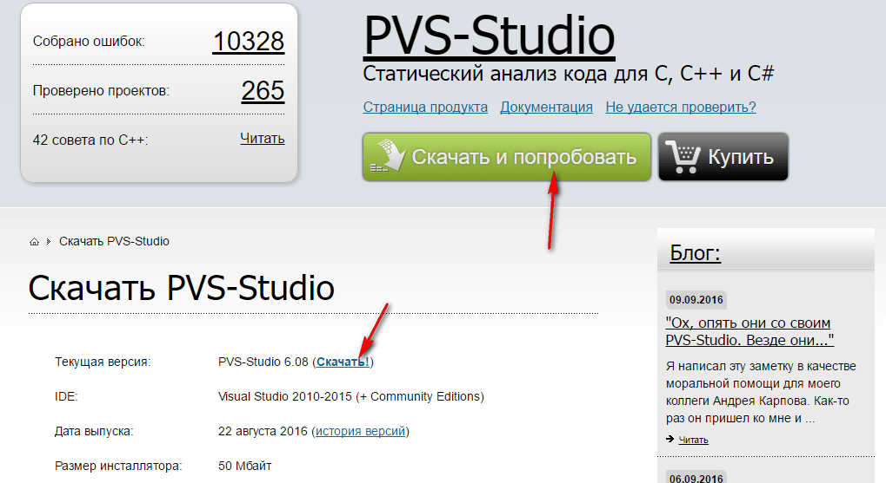

Installation is totally standard; there are even no special options to choose from. In my articles, however, I always try to describe even the simplest steps. So, here you are the screenshots:

---

**Installation of PVS-Studio** <!-- !details -->

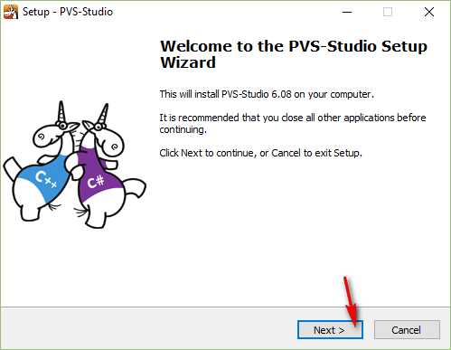

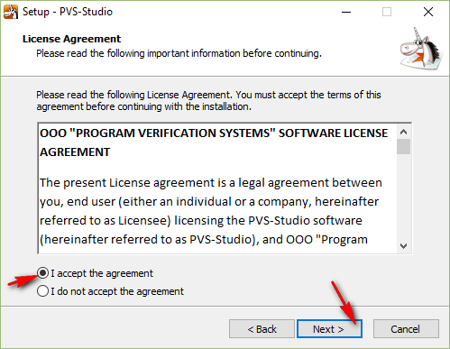

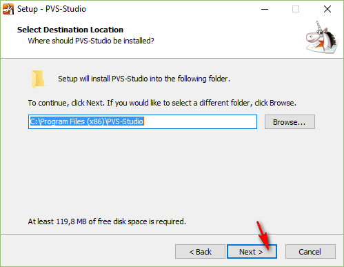

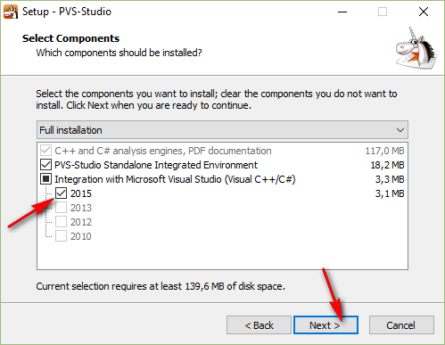

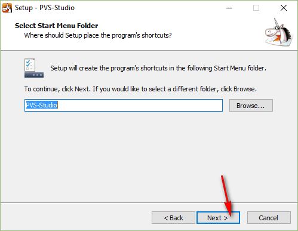

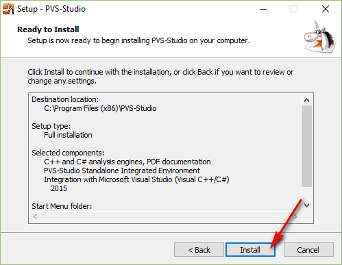

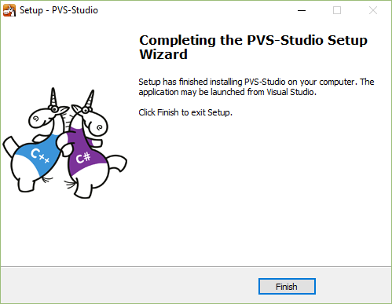

---

## How it all failed

I'm saying right away that I didn't read any documentation at first. I just installed the program and thought what's next? I found the following new items in the 'Start' menu:

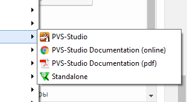

Intuition told me that the item I needed should have the same name as the program. Click. And here it failed me and showed this message:

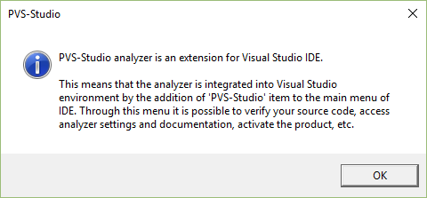

Honestly, I grew worried quite a bit. You see, I mostly work in Qt and keep Visual Studio rather as a tutorial program for my students.

OK. Perhaps I should try another menu-item, `Standalone`:

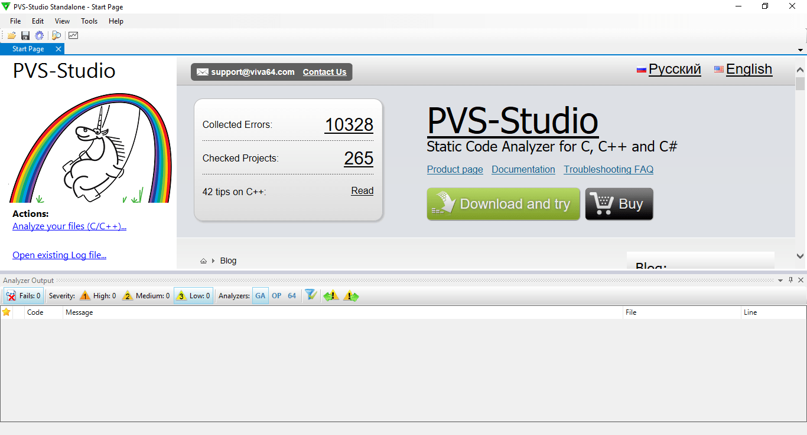

That's better. Now, an important side note. What I **expected** to be the algorithm of working with the analyzer is this: I open it, load my project's source files, and it finds bugs for me. This assumption turned out to be completely wrong, but we'll talk about that later.

So, at first I tried to load one of my files (I was worried by the fact that it allowed me to select only one file at a time):

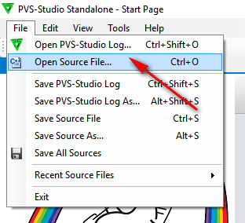

Here it is, but what's next? No more large or colorful buttons:

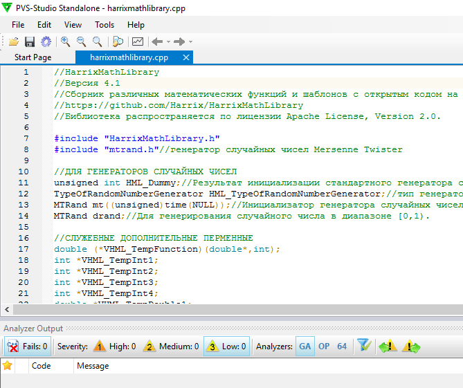

There is only one item in the main menu that looks like what I need:

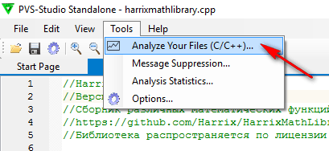

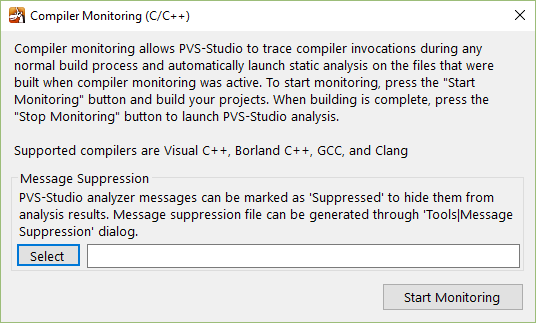

And here's where I acted silly. Instead of reading the text, I started clicking around on the buttons. When I clicked on `Select` the program asked for some `*.suppress` files, which was obviously not what I needed. The word `Compiler` caught my eye. OK, so I should click on`Start Monitoring`:

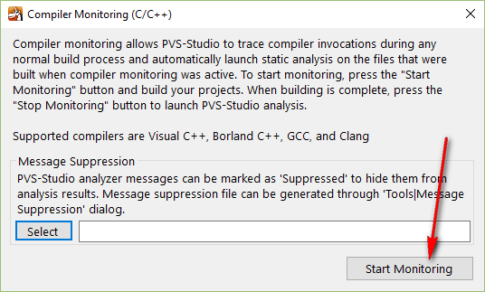

I thought that the program was scanning my computer for compilers, so it should take quite a while. And it really did (I waited for several hours), but I was happy to see that it started to find something at last:

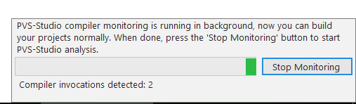

It was only some time later that I figured out the reason: I'd been working with my projects and compiling them while the monitoring process was running.

A couple of hours later, I felt the tool had found enough compilers and stopped it. However, it didn't output any results. What do I do then? Damn, now I've got to read the documentation.

The relevant link turned out to be not quite noticeable:

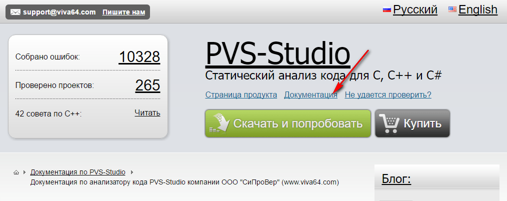


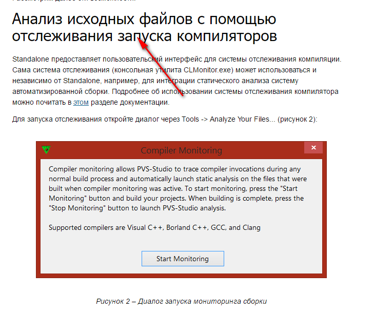

After reading the article, I finally figured out what to do.

## How it all worked out

This is how the analyzer **actually** works.

You start the monitoring process in PVS-Studio and then run the compiler on your project. When the compilation is done, stop the monitoring process, and wait a while for the program to output the analysis log.

I'll show you how it works using the test application Qt 5.7 with MinGW, which makes use of my [Harrix MathLibrary](https://github.com/Harrix/Harrix-MathLibrary) library, as an example.

Go to the analysis menu:

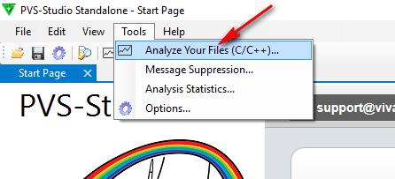

Start monitoring compiler launches:


The monitoring process can run in background:

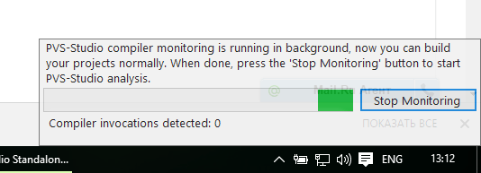

Compile the project:

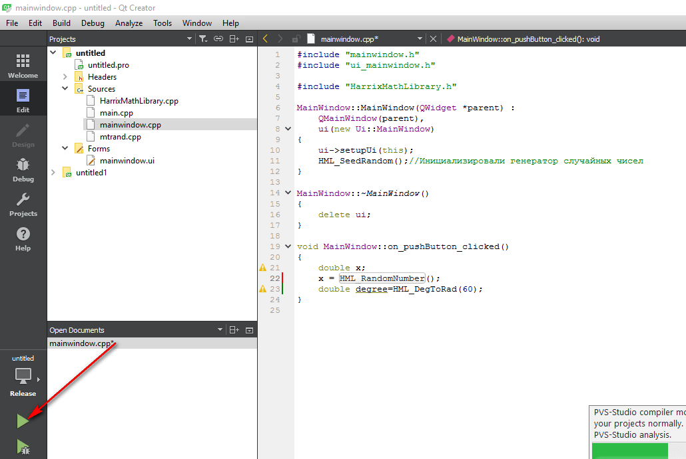

PVS-Studio has detected a launched instance of our compiler:

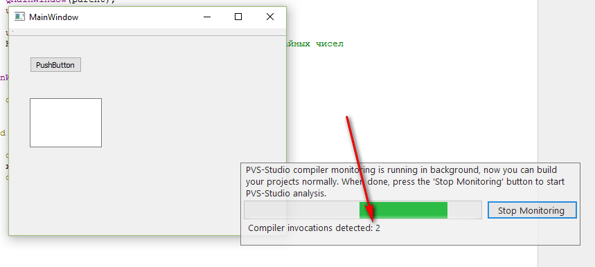

Stop monitoring:

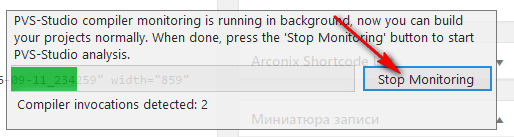

And here PVS-Studio poured a pile of warnings. Damn. I'd hoped for better results:

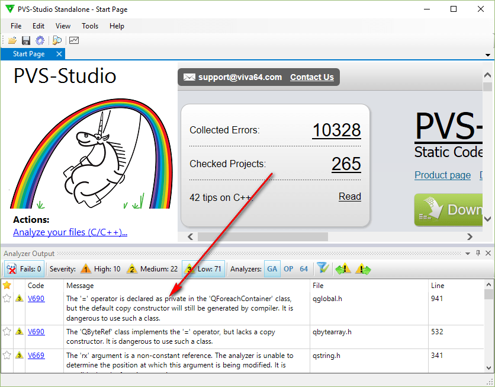

Double click on a warning takes you to the corresponding source file where the bug was found:

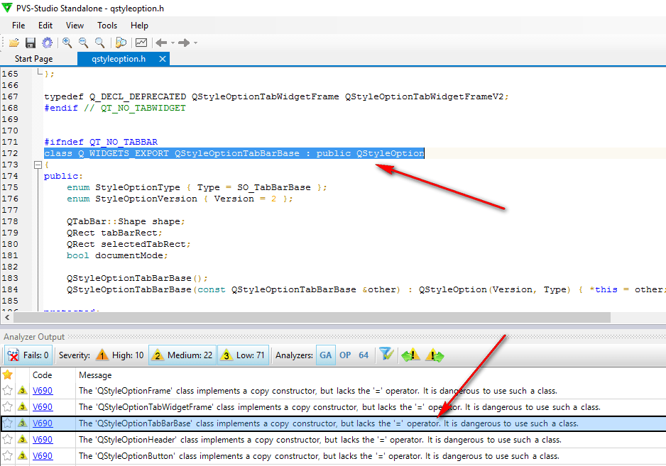

When you finally grasp the idea behind the program, working with it becomes easy, but it's not quite intuitive for a beginner.

Now let's see what bugs we've got. Are they really bugs at all?

**Warning.** When starting the compiler, rebuild the whole project. Just recently I was sad about 71 warnings, but after I fixed them and rebuilt the project, the tool issued over 1900 more warnings:

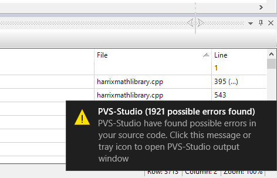

Now I feel like cursing.

## Analyzing errors

We have walked the path of my ascension to understanding how to use the program. Now let's take a look at the analysis results.

I'm not much interested in the bugs found in Qt itself — they are the responsibility of those who developed the compiler:

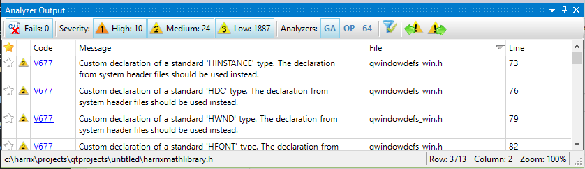

What about my own mistakes.

Most of the over 1900 warnings are `V550` warnings:

```text
> V550. An odd precise comparison. It's probably better to use a comparison with defined precision: fabs(A - B) < Epsilon or fabs(A - B) Epsilon
```

And I do agree with that warning in most cases. For example, the following code with (`F[i]==F[i+1]`) might cause problems:

```cpp
//identical elements
//are assigned identical ranks as arithmetic mean
for (i=0;i<VHML_N-1;i++)
 {
 if (F[i]==F[i+1])
  {
  j=i+1;
  while ((F[i]==F[j])&&(j<VHML_N)) j++;
  Sn=HML_SumOfArithmeticalProgression(i+1,1,j-i);
  Sn/=double(j-i);
  for (k=0;k<VHML_N;k++)
   if (Fitness[k]==F[i]) VHML_ResultVector[k]=Sn;
  i=j-1;
  }
 }
```

An even worse idea is to check the extreme positions of a Maxwell's wheel like it is done in the following dreadful code:

```cpp
if (((x==R)&&(v<0))||((x==l)&&(v>0))) v=-v*(1.-k);//if the wheel is in extreme positions,
```

And here's what I got on the following fragment:

```cpp
//Calculating arithmetic mean of two samples
xn=HML_Mean(x,VHML_N);
yn=HML_Mean(x,VHML_N);
```

```text
> V656 Variables 'xn', 'yn' are initialized through the call to the same function. It's probably an error or un-optimized code. Consider inspecting the 'HML_Mean(x, VHML_N)' expression. Check lines: 3712, 3713. harrixmathlibrary.h 3713
```

It's a quite disappointing error. I must have copied a code fragment but forgot to change some of the tokens.

Another silly mistake:

```cpp
int VHML_Result=0;
if (VHML_N1==VHML_N2)
    for (int i=0;i<VHML_N1;i++)
        if (a[i]!=b[i]) VHML_Result=-1;
        else
            VHML_Result=-1;
```

```text
> V523 The 'then' statement is equivalent to the 'else' statement. harrixmathlibrary.h 695
```

This function will always give a positive answer about an existing solution. I have never figured out what made me break all the computations of the `solutions` variable at the end of the function:

```cpp
double HML_LineTwoPoint(double x, double x1, double y1, double x2, double y2, int *solutions)
{
/*
This function is a two-point linear equation.
Value of y is returned for given x.
Input parameters:
 x - abscissa of point in question;
 x1 - abscissa of first point;
 y1 - ordinate of first point;
 x2 - abscissa of second point;
 y2 - ordinate of second point;
 solutions - stores the returned solution:
  0 - no solution;
  1 - solution found;
  2 - any number is a solution (the line is parallel to y-axis).
Return value:
 Value of y for given x.
*/
double y=0;

if ((x1==x2)&&(y1==y2))
{
    //this is the same point, so any number is a solution
    y=y1;
    *solutions=2;
}
else
{
    if (y1==y2)
    {
     // this line is parallel to x-axis
        y=y1;
        *solutions=1;
    }
    else
    {
        if (x1==x2)
        {
            //this line is parallel to y-axis
            if (x==x1)
            {
                y=y1;
                *solutions=2;
            }
            else
            {
                y=0;
                *solutions=0;
            }
        }
        else
        {
            y=(x-x1)*(y2-y1)/(x2-x1)+y1;
        }
    }
}

*solutions=1;
return y;
}
```

```text
> V519 The '* solutions' variable is assigned values twice successively. Perhaps this is a mistake. Check lines: 1788, 1821. harrixmathlibrary.cpp 1821
```

The next warning deals with me being overcautious rather than a real error: I set the summary variable to zero first, just in case:

```cpp
if (VHML_N>0) VHML_Result=0;
...

//Evaluating real-vector objective function
VHML_Result=VHML_TempFunction(VHML_TempDouble3,RealLength);

return VHML_Result;
```

```text
> V519 The 'VHML_Result' variable is assigned values twice successively. Perhaps this is a mistake. Check lines: 385, 395. harrixmathlibrary.cpp 395
```

PVS-Studio also found two identical functions in my code (I didn't favor `std` back then). Besides those two, it also found a few more, which is highly useful when you have a large project with lots of functions and can't recall if you have already used this or that function or not:

```cpp
template <class T> void HML_Swap(T &a, T &b)
{
/*
This function swaps values of two numbers.
Input parameters:
a - first number;
b - second number.
Return value:
None.
*/
T x;
x = b;
b = a;
a = x;
}

template <class T> void HML_NumberInterchange(T &a, T &b)
{
/*
This function swaps values of two numbers.
Input parameters:
a - first number;
b - second number.
Return value:
None.
*/
T x;
x = b;
b = a;
a = x;
}
```

```text
> V524 It is odd that the body of 'HML_Swap' function is fully equivalent to the body of 'HML_NumberInterchange' function. harrixmathlibrary.h 2349
```

And here's a classic error dealing with a missing type conversion:

```cpp
double HML_TestFunction_HyperEllipsoid(double *x, int VHML_N)
{
/*
Function of multiple variables: hyperellipsoid.
Test function for real optimization.
Input parameters:
x - pointer to original array;
VHML_N - size of array x.
Return value:
Value of test function at point x.
*/
double VHML_Result=0;

for (int i=0;i<VHML_N;i++)
  VHML_Result += (i+1)*(i+1)*x[i]*x[i];

return VHML_Result;
}
```

```text
> V636 The '(i + 1) * (i + 1)' expression was implicitly cast from 'int' type to 'double' type. Consider utilizing an explicit type cast to avoid overflow. An example: double A = (double)(X) * Y;. harrixmathlibrary.cpp 10509
```

As for this code, the analyzer issued a false warning, as `HML_ProportionalSelectionV2` returns a random value:

```cpp
NumberOfParent1=HML_ProportionalSelectionV2(VectorOfProbability,PopulationSize);
NumberOfParent2=HML_ProportionalSelectionV2(VectorOfProbability,PopulationSize);
```

```text
> V656 Variables 'NumberOfParent1', 'NumberOfParent2' are initialized through the call to the same function. It's probably an error or un-optimized code. Check lines: 1106, 1107. harrixmathlibrary.cpp 1107
```

A number of issues were found in the [Harrix QtLibrary](https://github.com/Harrix/Harrix-QtLibrary) library.

For example, it has a function for splitting a string into syllables. The tool gave a nice tip that I should merge the conditions:

```cpp
if ((i>=1)&&(i!=N-1))
{
    if ((HQt_GetTypeCharRus(S.at(i-1))==3)&&(HQt_GetTypeCharRus(S.at(i))!=0)&&(HQt_GetTypeCharRus(S.at(i+1))!=0))
        cut=true;
}

if ((i>=1)&&(i!=N-1))
{
    if ((HQt_GetTypeCharRus(S.at(i-1))==1)&&(HQt_GetTypeCharRus(S.at(i))==1)&&(HQt_GetTypeCharRus(S.at(i+1))!=0))
        cut=true;
}
```

```text
> V581 The conditional expressions of the 'if' operators situated alongside each other are identical. Check lines: 1140, 1147. harrixqtlibrary.cpp 1147
```

The loop in the following piece contains a Boolean variable, in, that will always be `true`:

```cpp
int VHQt_Result = -1;
bool in=false;
int i=0;

while ((i<StringList.count())&&(in!=true))
{
    if (StringList.at(i)==String)
        VHQt_Result=i;
    i++;
}

return VHQt_Result;
```

```text
> V560 A part of conditional expression is always true: (in != true). harrixqtlibrary.cpp 2342
```

There are also fragments with duplicate code when filling models with items:

```cpp
item = new QStandardItem(QString("HML_RealGeneticAlgorithmTournamentSelectionWithReturn"));
model->appendRow(item);

item = new QStandardItem(QString("HML_RealGeneticAlgorithmTournamentSelectionWithReturn"));
model->appendRow(item);
```

```text
> V760 Two identical blocks of text were found. The second block begins from line 86. mainwindow.cpp 83
```

## Verdict

### Cons

* The program is not intuitive; it's not easy to get started with. If I simply dropped by their site, downloaded a demo-version, and gave it a try, I'd most likely uninstalled it, none the wiser.
* Old-fashioned design.
* Syntax highlighting resembles that in Notepad++ (and that's a plus), but I am also accustomed to Notepad++ highlighting all the other instances of a selected keyword, as well as highlighting the corresponding closing parenthesis when selecting an opening one.

### Pros

* The program does know how to do its job, which is the most important thing. It can catch lots of hidden bugs or warnings that you are not likely to ever notice.
* Once you have figured out how to use it, working with the analyzer becomes easy and comfortable.
* The tool supports several compilers, including those used in Qt builds.

**The final conclusion**: this program is certainly a **must-have**. A very handy tool to manage your code's quality.

P.S. And I was hoping there would be no bugs.

P.S.S. Over 1900 warnings!!
